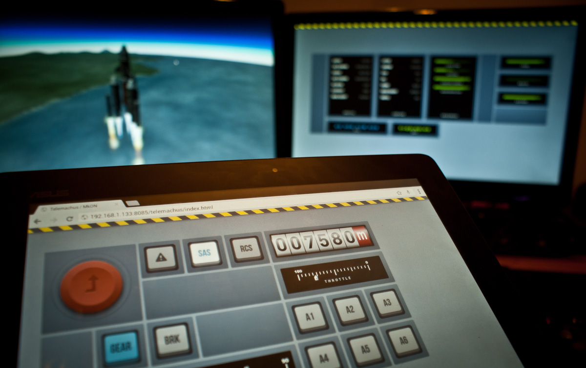

Please refer to the [original project](https://github.com/chhhrrriiisss/mkon/) for more info, i only fixed the icons not working.

 

_MkON controls on a touch tablet, with a second monitor showing resource information._

## updates

- edited index.html to refer to the right awesome-font.css file
- added the previously referred file to the right location

## Installation

- You need to download and install the latest release of [Telemachus Reborn](https://github.com/TeleIO/Telemachus-1/releases/), this is most easily done by searching for it in ckan, and then pressing the checkmark for the latest version on the right (it is "incompatible", this is not true).
- Download the latest version of [mkon-iconfix](https://github.comBlokheck011/mkon-iconfix/releases), extract the zip and make sure the extracted folder is called "MKON", with all the files inside (e.g. index.html)
- Go to your KSP Folder/GameData/Telemachus/Plugins/PluginData/Telemachus and delete the mkon folder (if there is one already). 
- Copy the mkon folder into the above folder.
- Load up KSP and open Telemachus as you would normally - follow the [Telemachus user guide](https://github.com/richardbunt/Telemachus/wiki/User-Guide).
- open the telemachus menu

## How to use

Please see the [wiki](https://github.com/chrisnic/mkon/wiki).

## License

[Attribution-NonCommercial-NoDerivatives 4.0 International](http://creativecommons.org/licenses/by-nc-nd/4.0/)
